# Team Sigma
## **Mealery** - CS 326 Final Project Fall 2020

## Overview
---
Mealery is a web platform that provides students and other people, who don't have the time to cook meals, with weekly meal plans from local restaurants, connecting restaurants with bulk orders of multiple days and people with food guaranteed for the period they select. 
Mealery is an innovative platform because as of today there aren’t any means for college students or young individuals to order a meal plan from the restaurants they love. Moreover, college meal plans are generally too expensive for self dependent students. Mealery aims to be a cheaper alternative to college meal plans with a wider variety of food options sourced locally to support local restaurants and dependent small businesses.

## Team Members
---
| Name       | Github Alias 
|--------------|-----------|
| Ananth Preetham| @infinityp913   |
|Harshal Dhelia| @hdhelia    |
| Siddharth Preetham| @sid0913    |

## User Interface:
---
We have three broad groups of UI views:

**Welcome View UI**

This is the set of pages that welcomes a new user (who hasn't logged in) and serves as a hook to attract potential users. This UI includes the **Welcome page** that features the app name, our tagline, featured restaurants and some customer reviews. There's a login and sign up section to the top right of the page. 
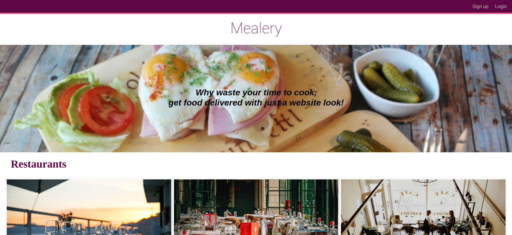
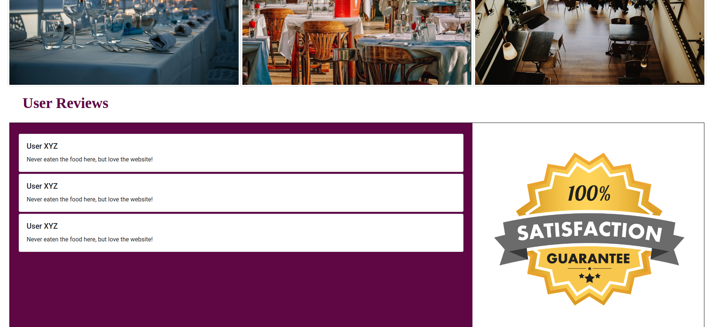
On clicking login/signup the user is presented with a pop up box with a pretty slide in animation to login/signup.
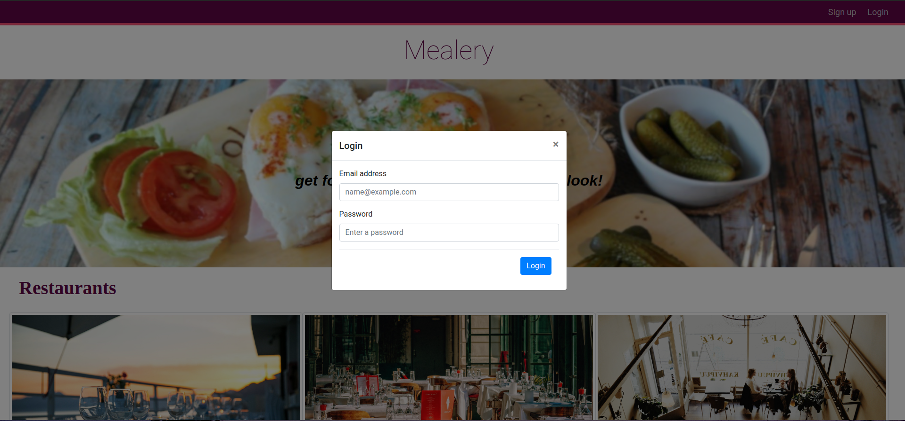
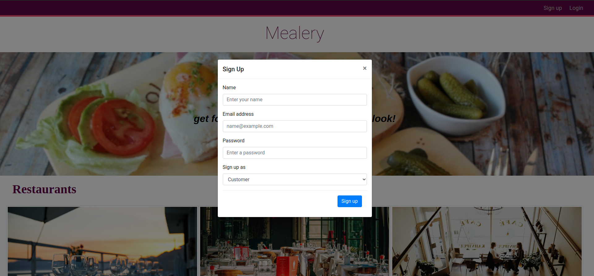

On clicking any of the featured restaurants, a dedicated showcase page for the restaurant opens up with the restaurant's menu, options to add to cart (requires logging in) and customer reviews at the bottom. Here's a preview of the restuarant Iya's showcase page

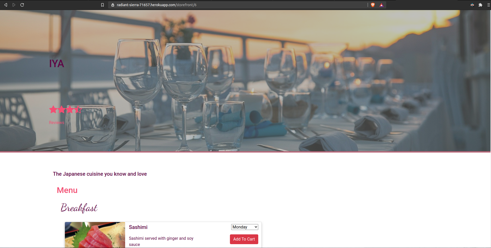
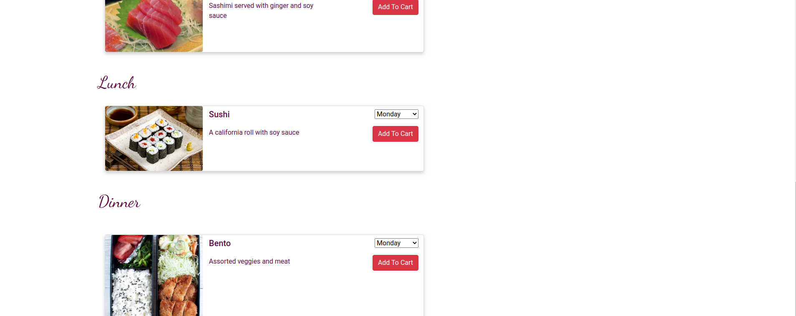

**Customer View UI**

This is the set of pages that a user sees on logging as a customer (the user that buys meal plans). This UI looks pretty similar to the initial welcome page. The main differences include the customer's name being displayed on the nav bar with a friendly greeting, logout button and a cart button. 

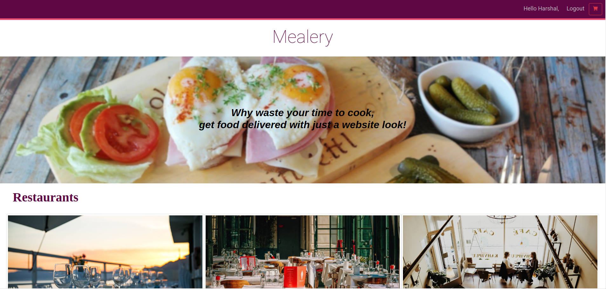

In the customer view UI, the customer can add meals to cart from the restaurant showcase pages (identical to the showcase page in the welcome UI). This adds the meal cards to the cart page by selecting the day the customer wants the meal for. This is the cart page:

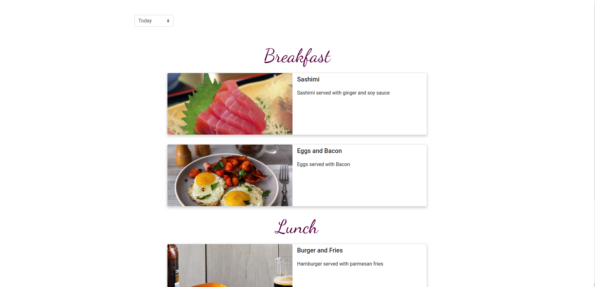
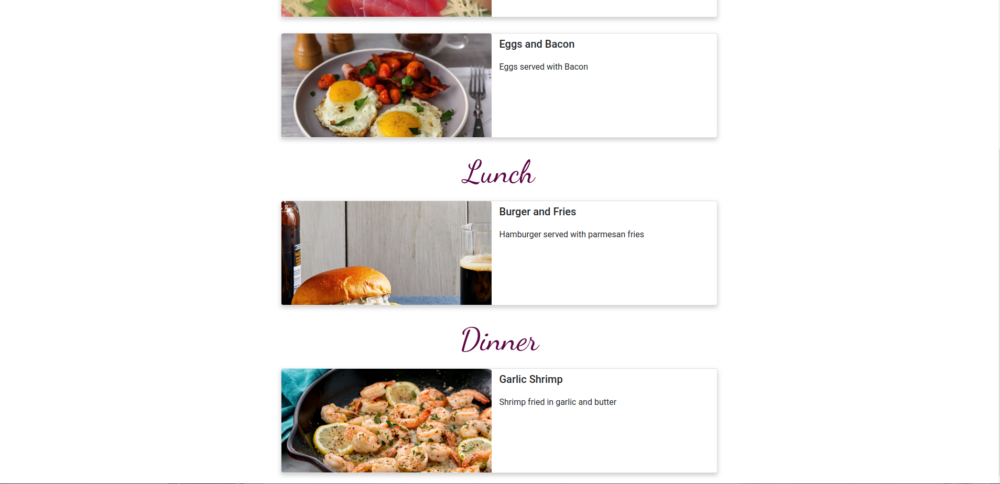

The customer can select the day from the dropdown to display the cart for the respective day.  

**Restaurant View UI**

This is the set of pages that a user sees on logging as a restaurant. This set of pages has a side navigation bar (that can be minimized using the burger icon) that shows the Mealery logo, logged in restaurant name and list all the pages in the Restaurant View UI. There's a "person icon" to the top right of each page. There are three pages in this UI:

1. **Orders Dashboard**  
This page shows the restaurant's orders for each day (selected from the dropdown), divided into breakfast, lunch and dinner. If there are no orders for a particular meal (breakfast, lunch or dinner) then it shows an empty list. This helps restaurants to plan out the meals they have to make for the day or the entire week.
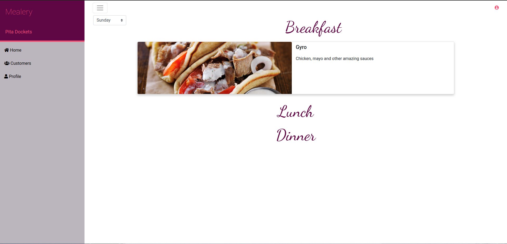

2. **Customers List**
This page shows the list of cards for the customers of the logged in restaurant. Each card has information for the respective customer along with the customer profile pricture.
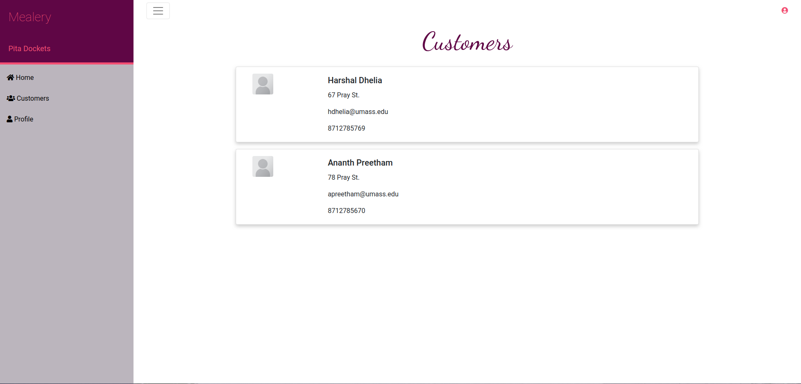

3. **Restaurant Profile**  
This page shows general and account profile for the logged in restaurant. Here, the user can edit any of the fields and save the changes (which updated the database). On editing the name of the restaurant, the change is refelcted in the side navigation bar (on reloading).
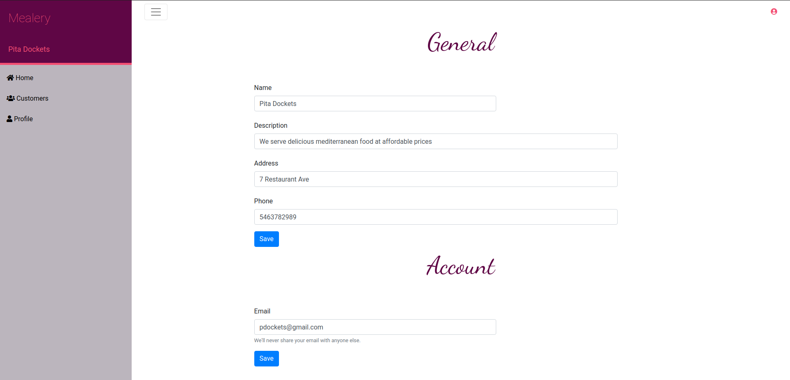

## API Table
---
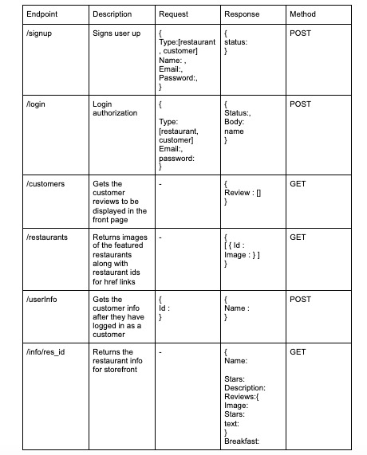
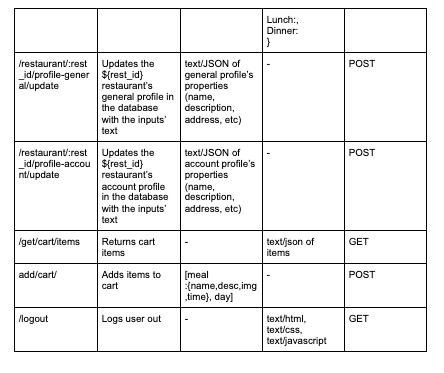
## Database
---
The tables share a primary key called id  

**Credentials table**:
1. Table to store user credentials
2. Template: credentials(id int PRIMARY KEY, email varchar(225), salt varchar(225), hash varchar(225), type varchar(1))
3. Type denotes whether the user is a restaurant (‘R’) or a customer (‘C’)
4. New users are given ids that are the output of their emails passed through a hash function

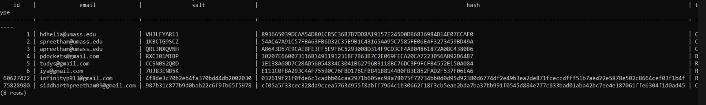

**Customers table**:
1. Table to store customer information
2. Template: customers (id int PRIMARY KEY, name varchar(225), phone_number varchar(225), address varchar(225), image varchar(225), email varchar(225))

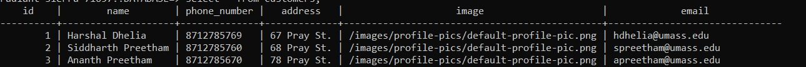

**Restaurants table**:
1. Table to store Restaurant information
2. Template: restaurants (id int PRIMARY KEY, name varchar(225), description varchar(225), address varchar(225), email varchar(225), phone_number varchar(225), image varchar(225), menu varchar(600), customer_list varchar(600), orders varchar(600), reviews VARCHAR(600))

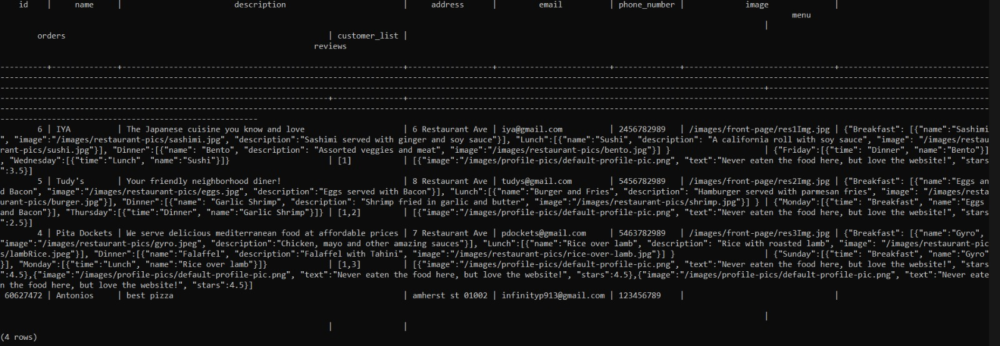

## URL Routes
---
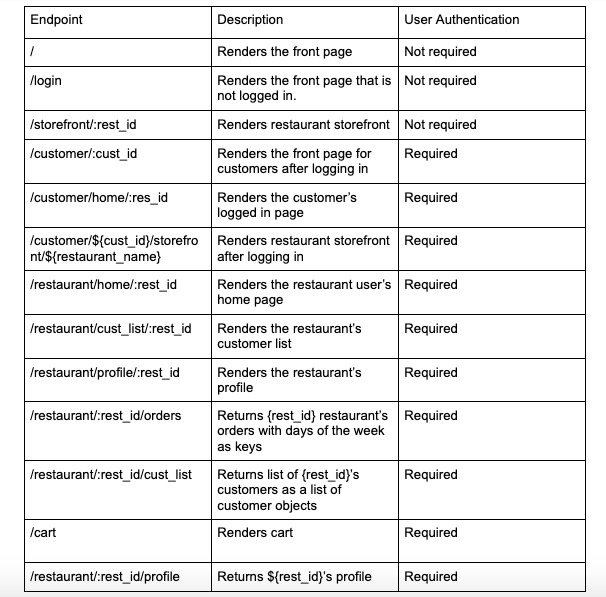
## Authentication
---
There are two ways that the user can sign in/log in => As a Customer or as a restaurant owner. In order to implement the authentication, we have used passport and express-session. The users must provide the correct credentials (email and password) using which they are authenticated. Once logged in, users are directed to their respective user interface (separate endpoints for each of them). Users who go to the main page are redirected to their logged in dashboards if they had already logged in before. Once a customer logs in successfully, they are redirected to the endpoint (/customer/home/:res_id) with their unique res_id and similarly when a restaurant owner logs in successfully, they are redirected to the endpoint (/restaurant/home/:res_id).

## Division of Labor
---
- Harshal Dhelia (@hdhelia):
    - Made the front page 
    - Set up the authentication/authorization
    - Worked on the server endpoints related to the front page
    - Worked on the database calls related to the front page
- Ananth Preetham (@infinityp913):
    - Made the orders dashboard, restaurant list page, the restaurant profile page
    - Worked on the server endpoints related to the aforementioned pages
    - Worked on the database calls related to the aforementioned pages
- Siddharth Preetham (sid0913):
    - Made the restaurant store front page and cart page
    - Set up the heroku app and maintained the heroku postgres database
    - Worked on the server endpoints related to the aforementioned pages
    - Worked on the database calls related to the aforementioned pages

## Conclusion
---

This project enabled us to exercise the web development theory we learnt in class.  In bridging the gap between the said theory and its practical application, we encountered numerous hurdles. Establishing communication between our different pages was troublesome. Authentication brought along with it its own difficulties. Communication between the pages and database posed a few issues too.

We learnt how the server-client relation works and how we can organize our project files accordingly. We implemented routing and endpoint and understood how they are essential to a web app, making it more organized.  We understood the various other nuances of web development and debugging like the CORS errors.

We learnt how a seemingly herculean task such as building a website like ours, no matter how tough and time consuming it may seem, can be accomplished by dividing it into milestones and smaller achievable goals spread across a certain time frame. 
