# Data Interactions   
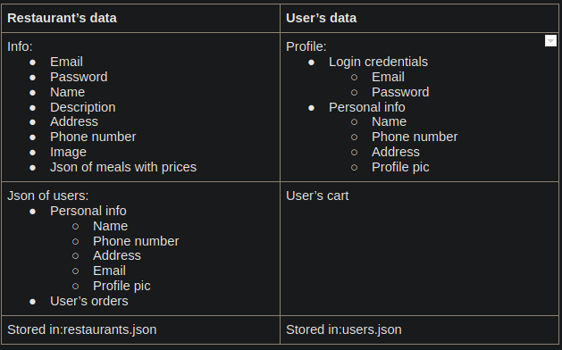  

Note: User's orders and user's cart contains a json of meals, day of the week and meal of the day at which it is to be delivered.

# Breakdown of labor  

Ananth Preetham (@infinityp913) - worked on the HTML, CSS and bootstrap for the restaurant side home page, customer list page and profile page

Siddharth Preetham (@sid0913) - worked on the HTML, CSS and bootstrap for the customer side homepage, profile page and user's cart page

Harshal Dhelia (@hdhelia) - worked on the HTML, CSS and bootstrap for the main homepage, review section and restaurants grid

# Wireframes  

## Homepage wireframe:

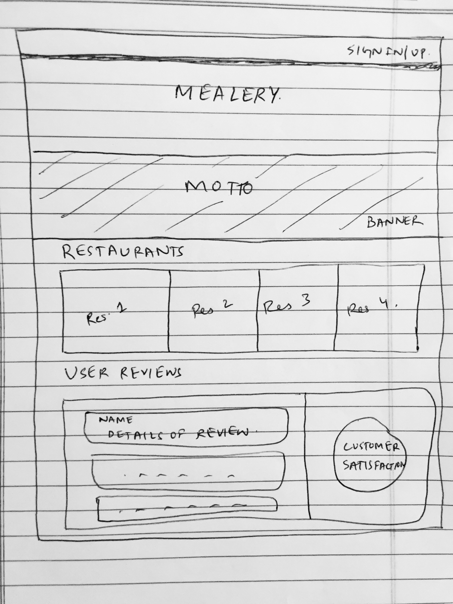

## Customer side wireframes:
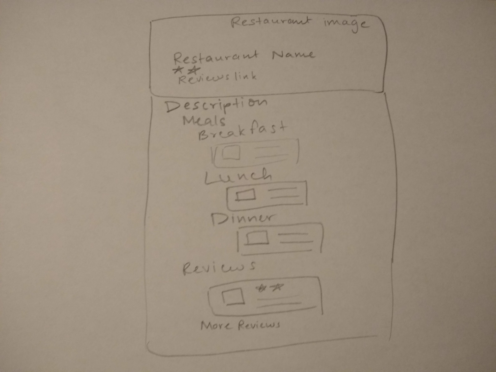
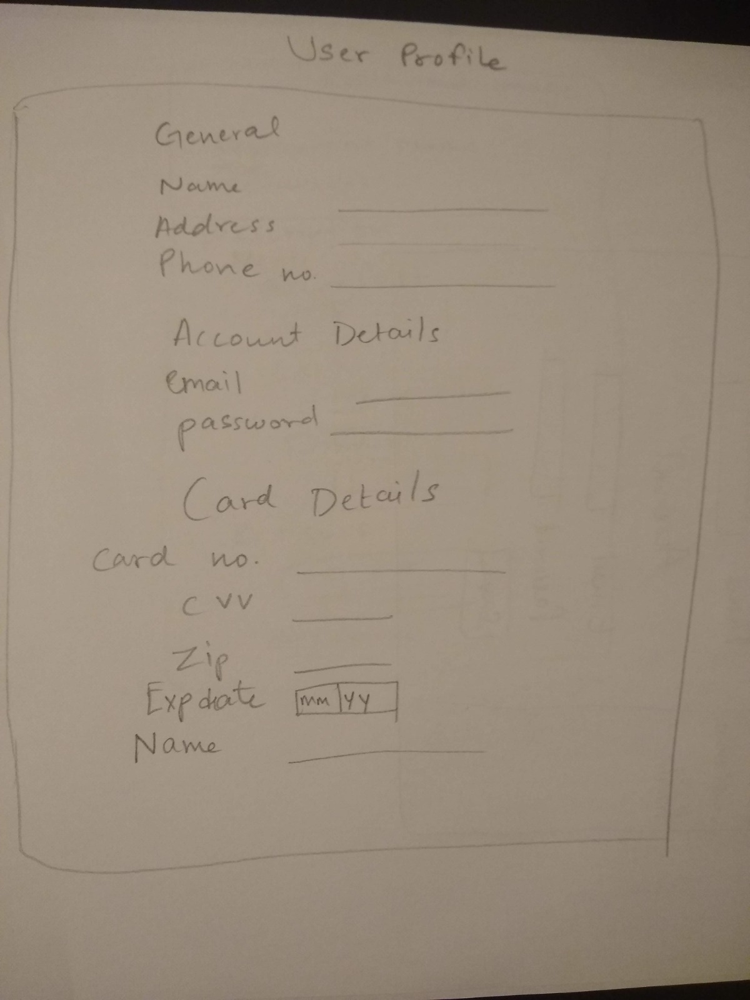

## Restaurant side wireframes:
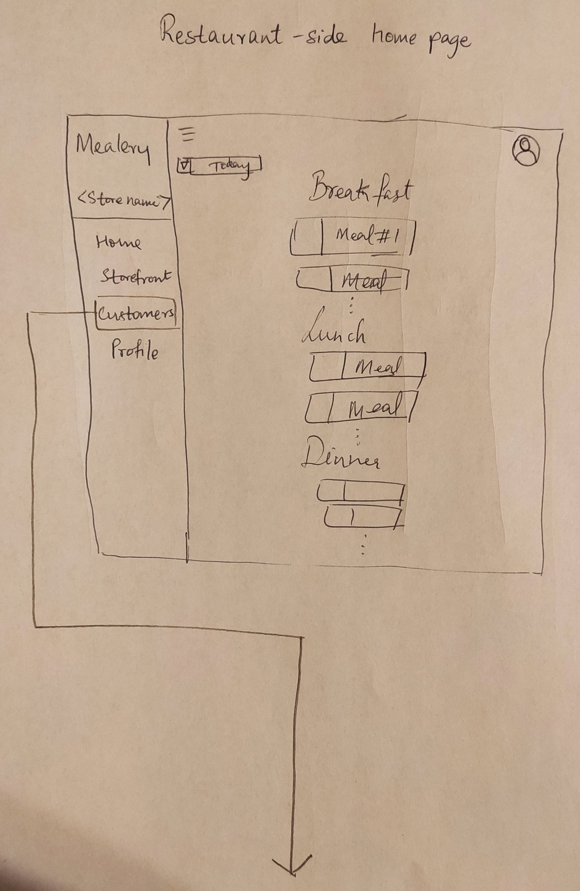 
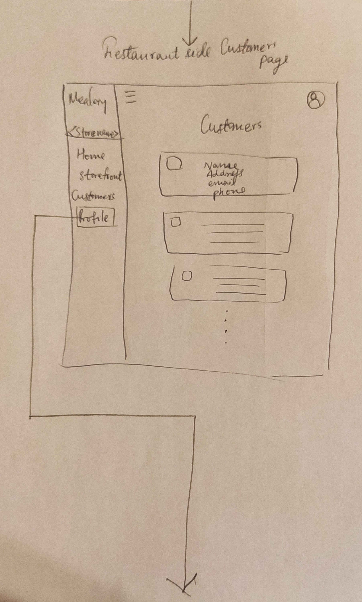
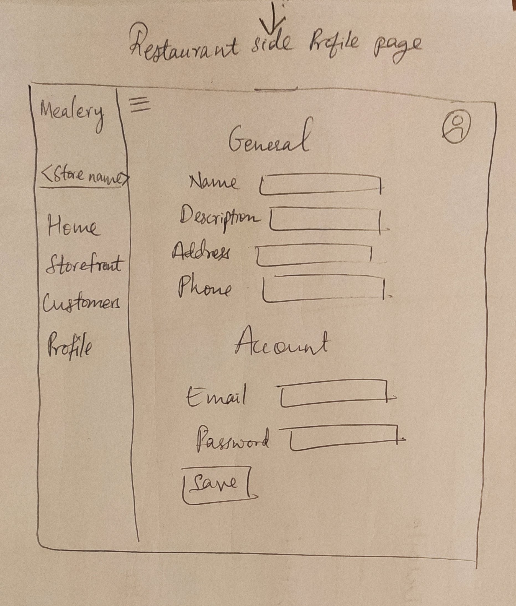

# HTML/CSS/Bootstrap Mockups  

## Home page:

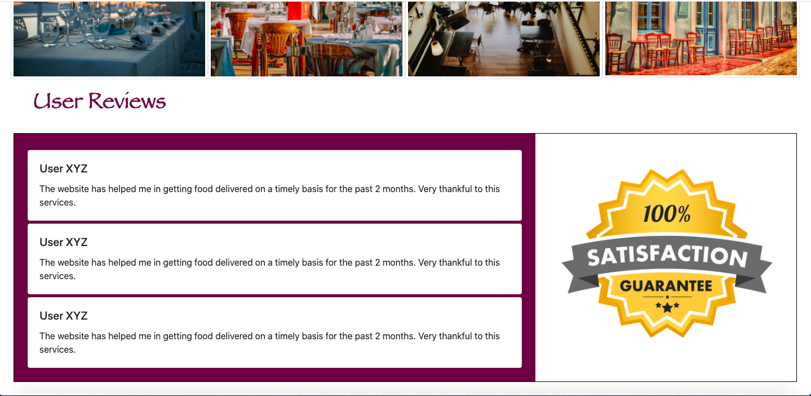

## Customer side:

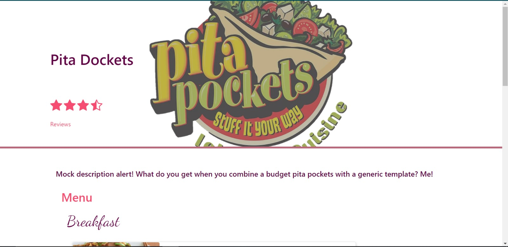
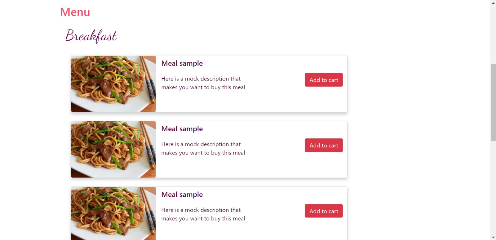
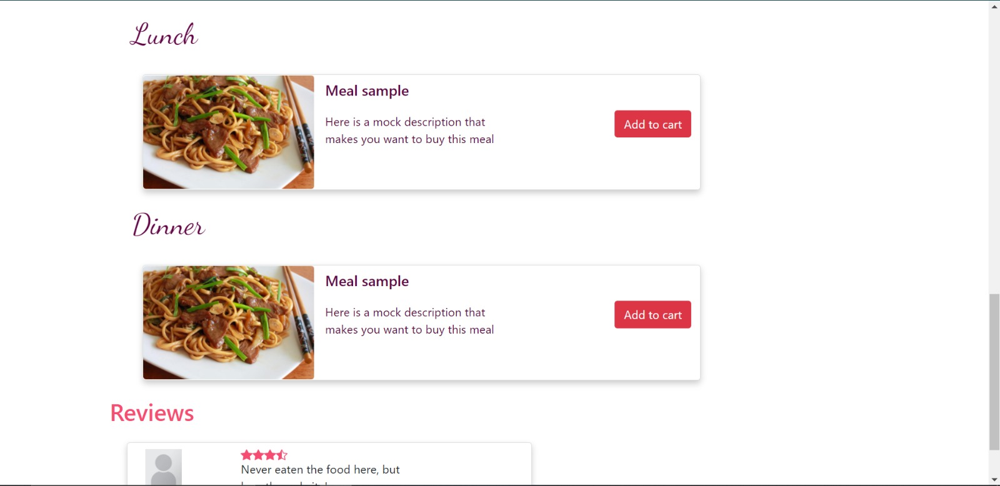
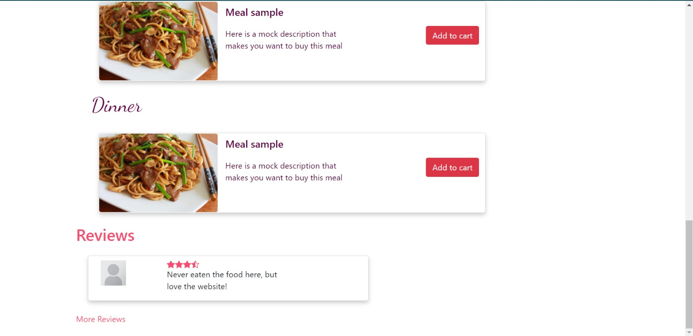
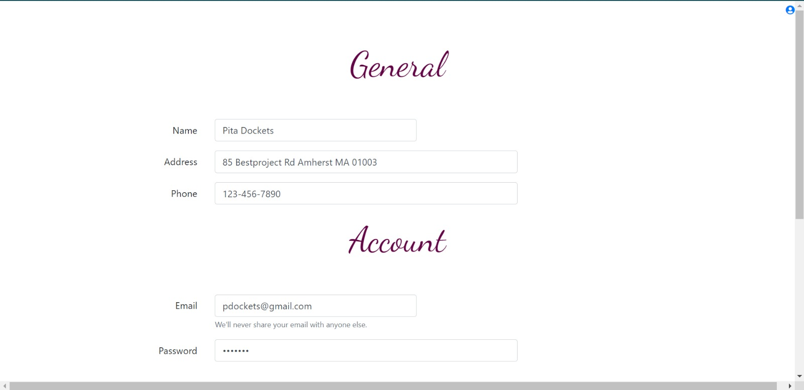
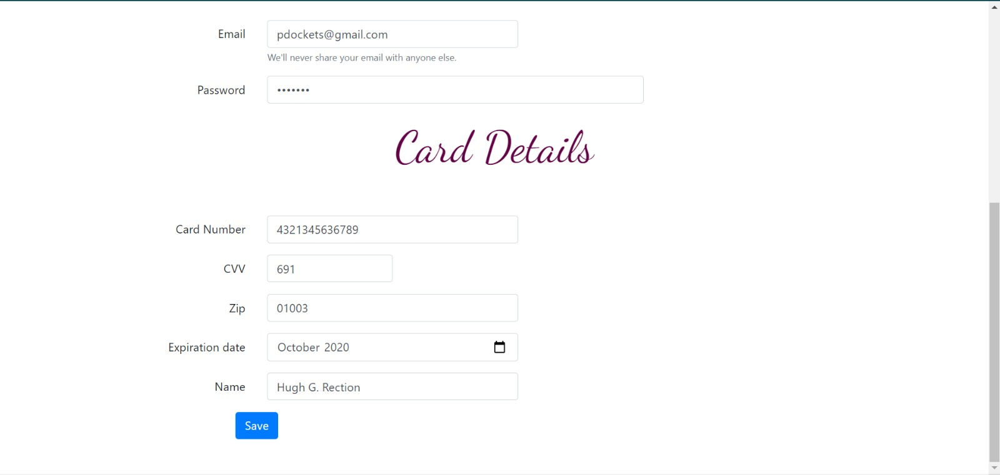

## Restaurant side:

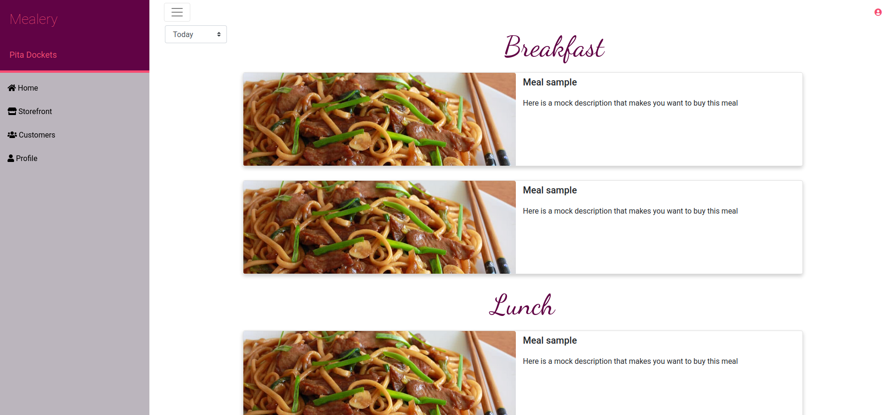
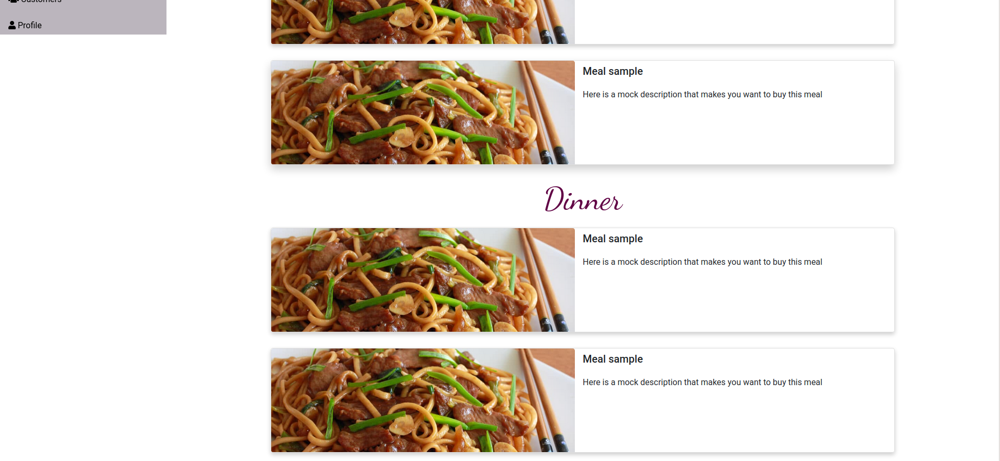
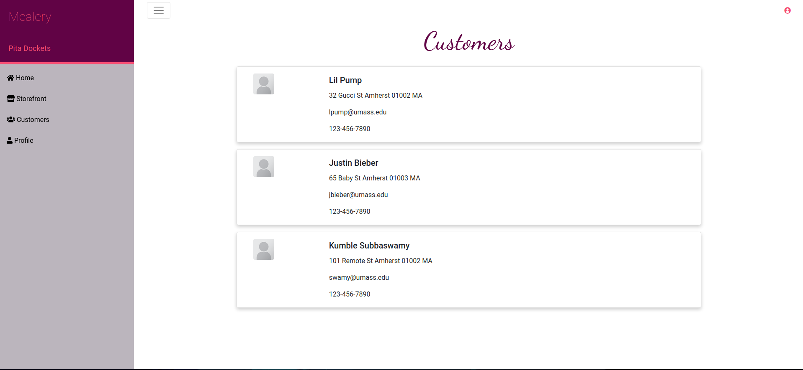
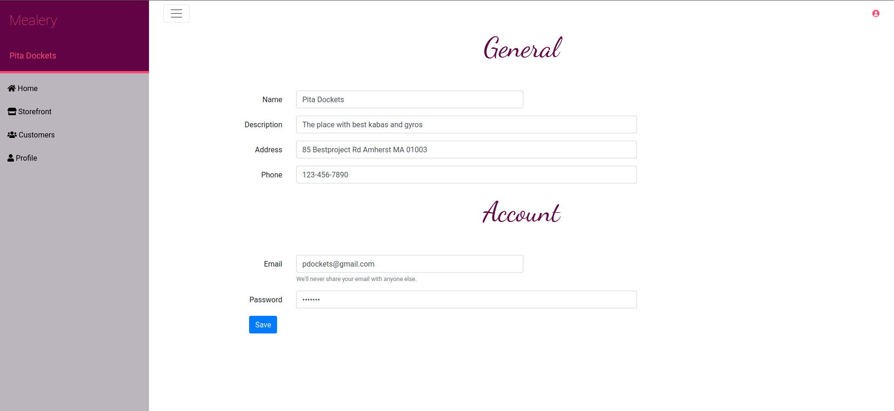