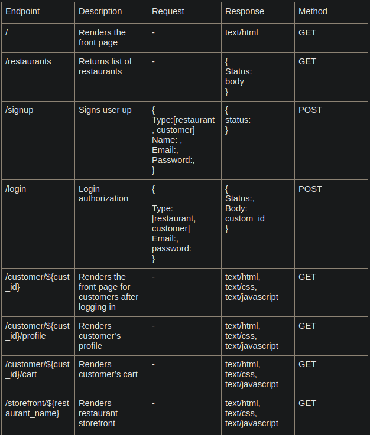
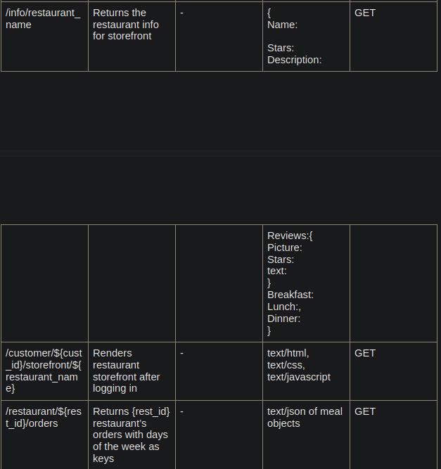
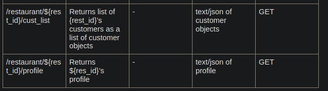
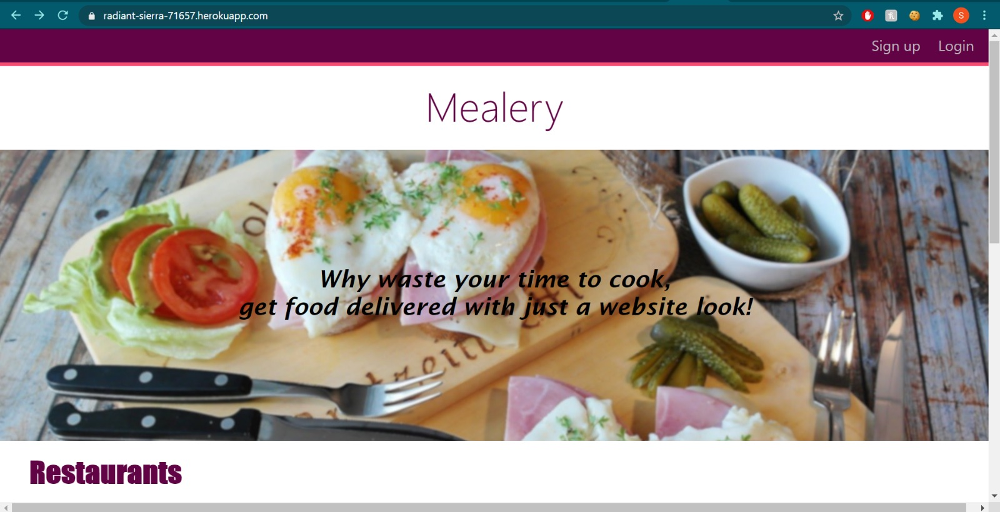
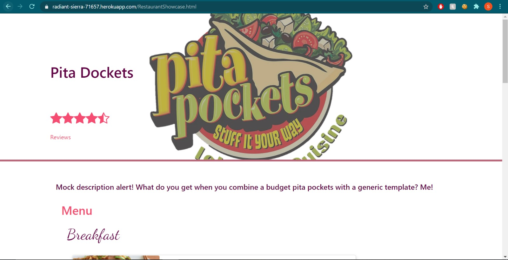
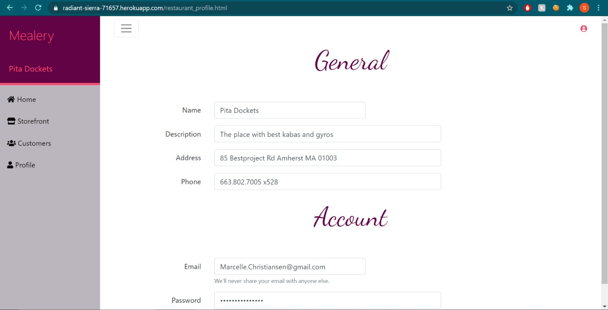
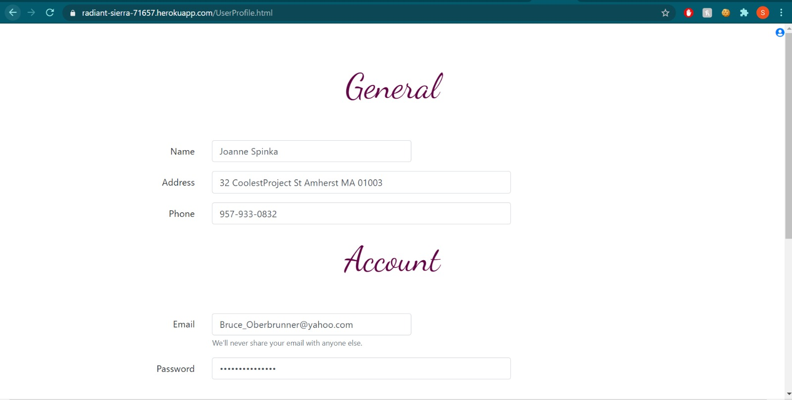

# Mealery's API
  

# Screenshots and descriptions of client interface

# URL of Heroku app
https://radiant-sierra-71657.herokuapp.com/

# Division of labor

Ananth Preetham (infinityp913) worked on the front end js for the restaurant side home (orders) page with the logic for the dropdown day selector, the customers list page and the profile page. He also implemented the endpoints used in each of the js files.

Siddharth Preetham (sid0913) worked on the front end js for the user side restaurant showcase page and the logic for the "more review" button. He also worked on deploying the app on Heroku.

Harshal Dhelia (hdhelia) worked on the front end js for the front page
